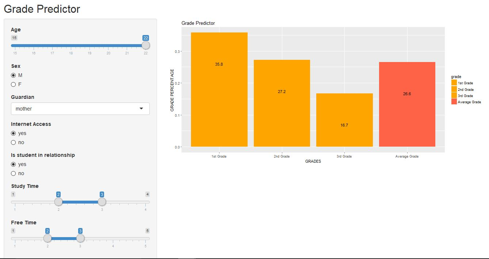
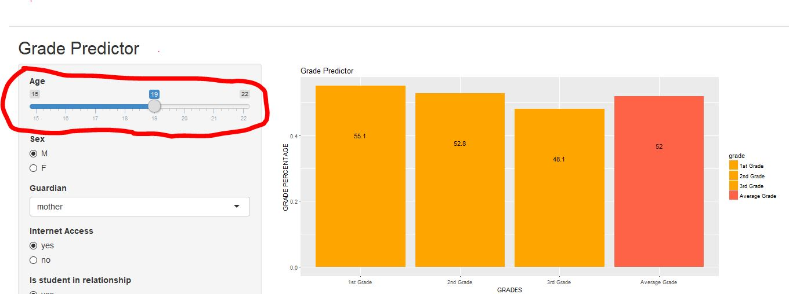
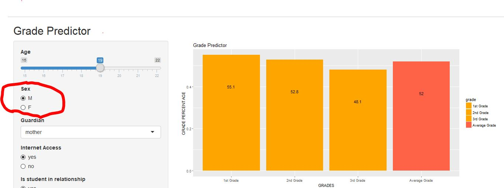
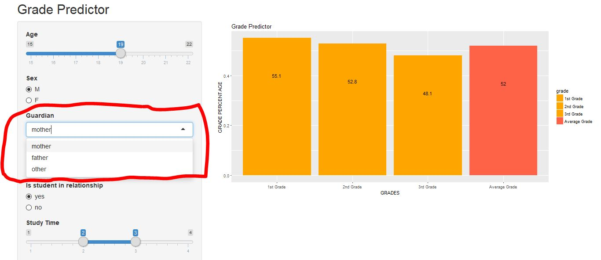
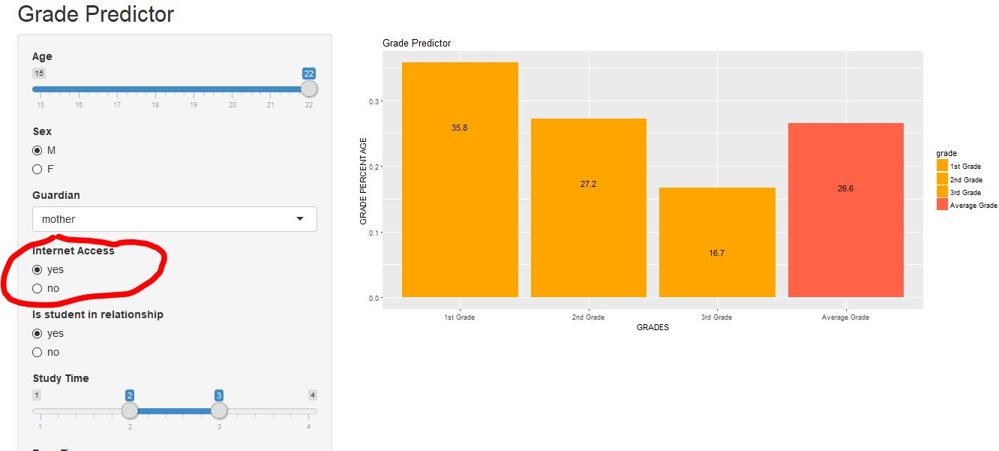
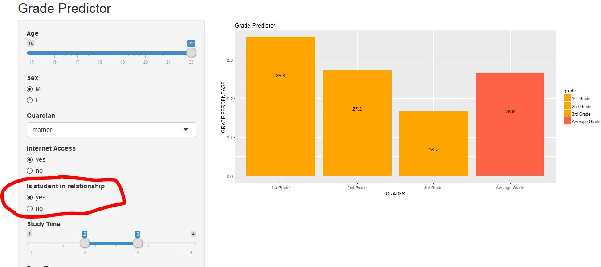
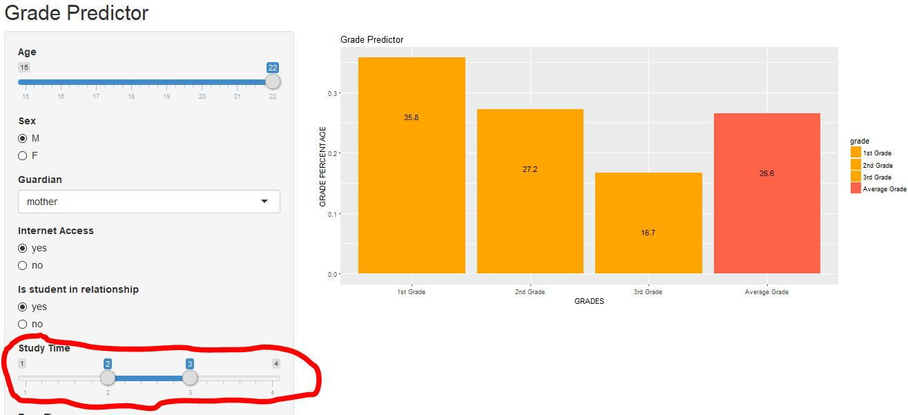
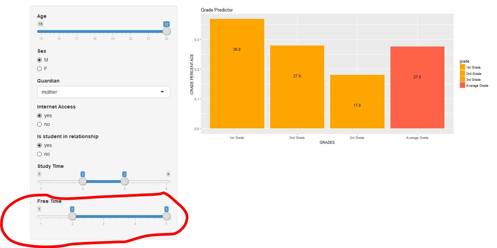

# Documentation

This app predicts student grades based on the inputs given and allows users to see how a change in input would effect their grades. This app will assist students, teacher, and parents in planning for a desired grade. The corresponding value for each grade is on top of each bar in text to make it easier for the user.

Enter the student age using a slider input.

Enter the students sex using a radio input.

Select what guardian a student has.

Select if a student has access to internet at home or not.

Select if student is in a relationship or not.

Select how many hours a day a student studies.

Select how many hours a day of free time a student has.
