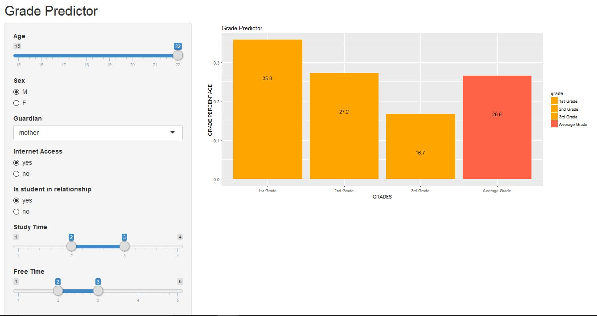
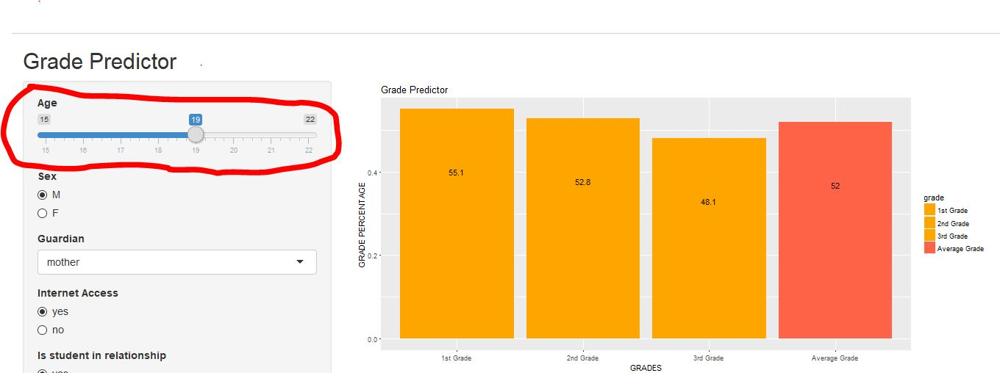
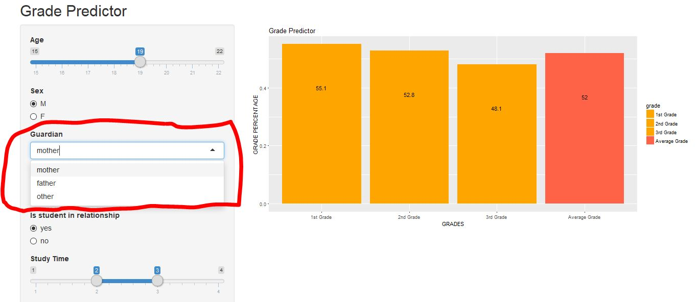
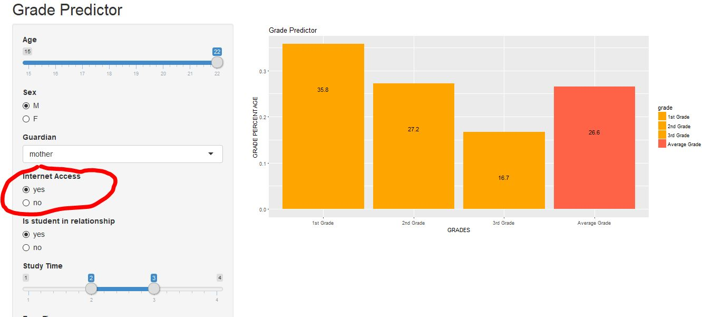
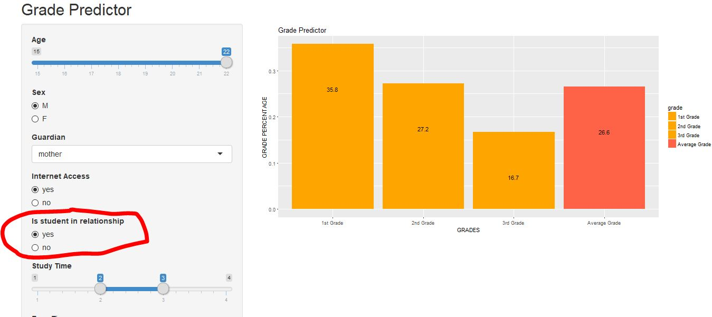
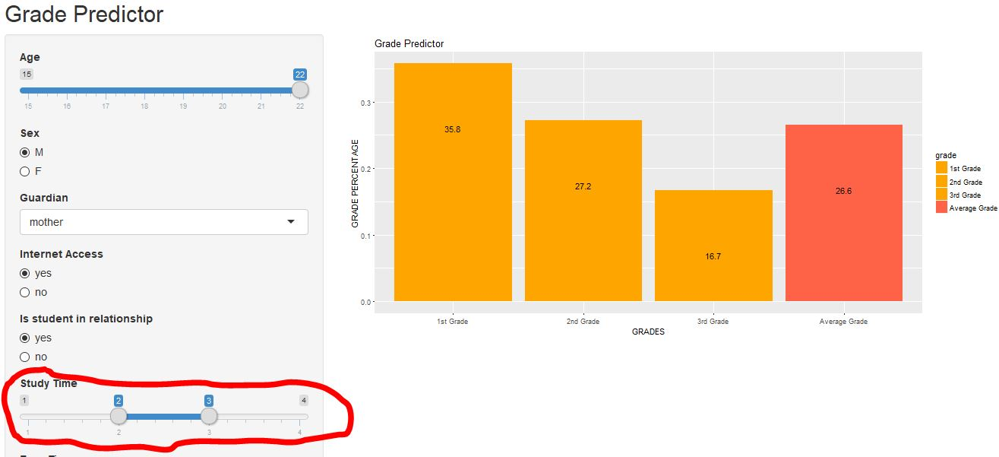
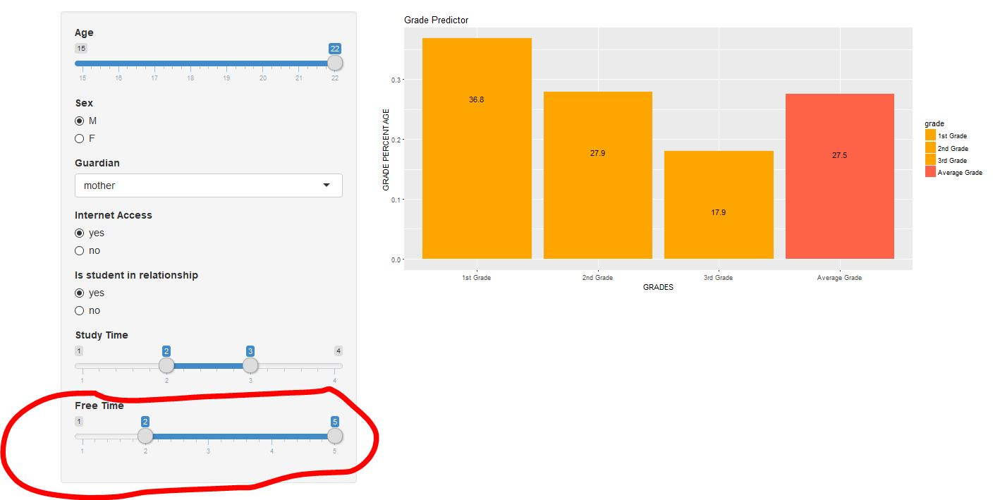

# Reflection

The feedback I got from my peers suggest that my app was easy to use. The app was very simple and straight forward and neither review suggest usability issues. Watching my peers use my app was pleasant because the app was used the same way I expected it to be to be used. From the feedback, I believe it would be appropriate to change the theme of the plot, title of the plot and remove the legend given the time frame you have to improve the app. There was a suggestion to add another plot. I do not believe I will be able to complete this in time. The change of title was the least valuable suggestion. The removal of legend was the most valuable suggestion. Watching my peers use my app without being able to say anything then getting the opportunity to discuss with them after about their thoughts and confusion of the app was really valuable. Creating issues of the feed in each others repository was also valuable it gave something to refer back to when making changes to the app but it was less valuable then the in person interaction. Initially I also wanted to visualize the variance of the of the predictions the models in the back round were making. I felt it was best to leave this out given the scope of this project and after review my problem statement. If I were to redo this app again from scratch I would try and predict if a student will pass or fail a course instead of predicting a students exact grade. In this situation I would use a logistic regression model to run the predictions and use a scatter plot for the visualizations of the app where the points are colored and can cluster based on the features in the dataframe being used.

### Documentation

This app predicts student grades based on the inputs given and allows users to see how a change in input would effect their grades. This app will assist students, teacher, and parents in planning for a desired grade. The corresponding value for each grade is on top of each bar in text to make it easier for the user.

Enter the student age using a slider input.

Enter the students sex using a radio input.

Select what guardian a student has.

Select if a student has access to internet at home or not.

Select if student is in a relationship or not.

Select how many hours a day a student studies.

Select how many hours a day of free time a student has.
